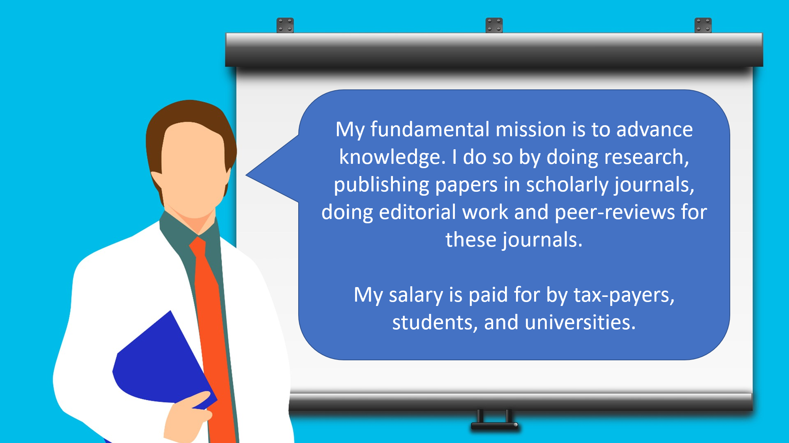
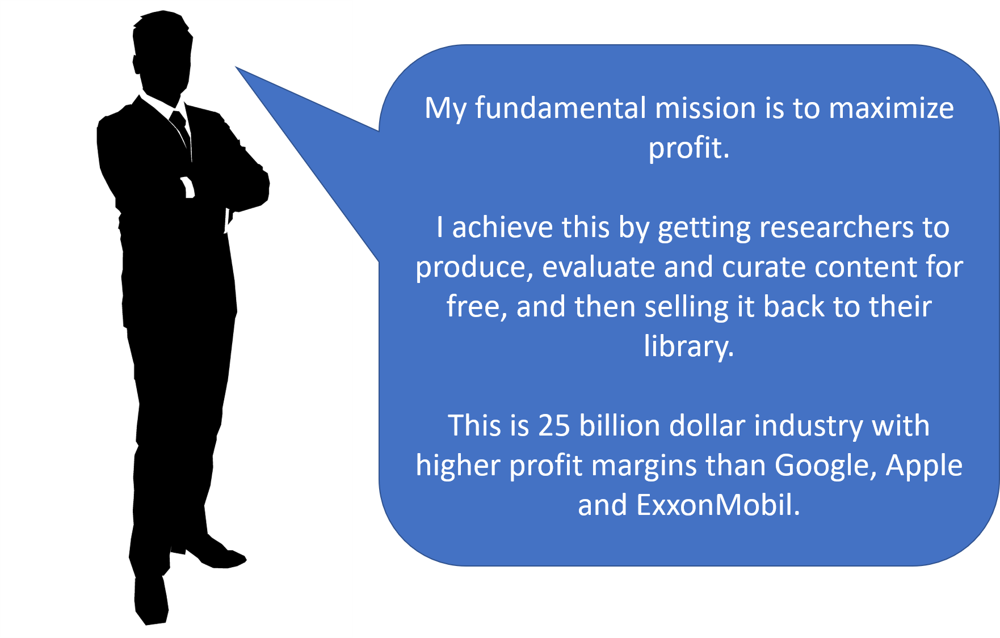
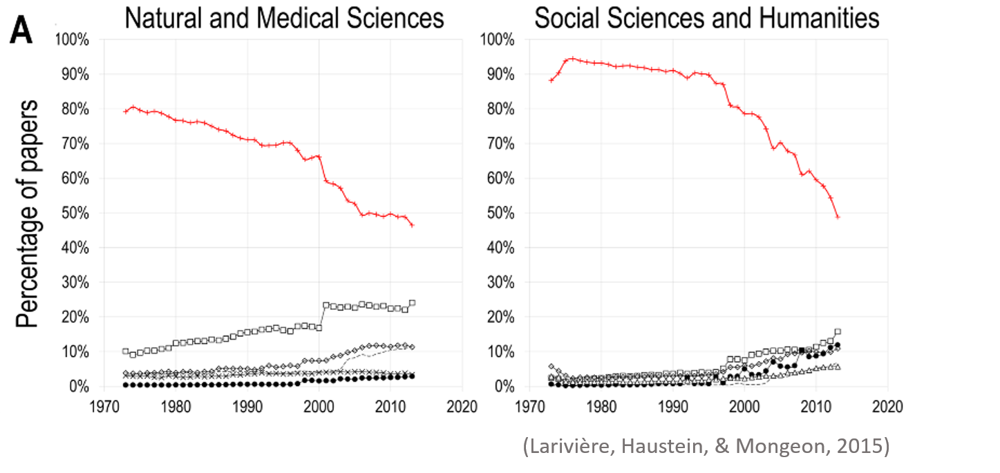
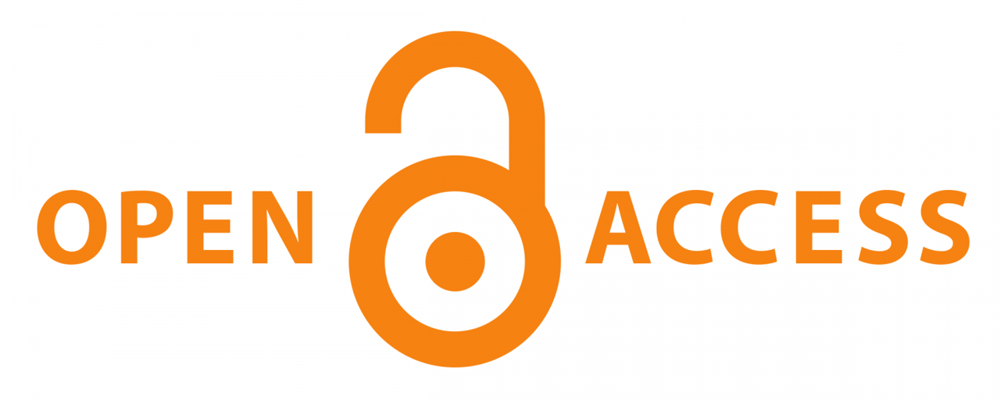
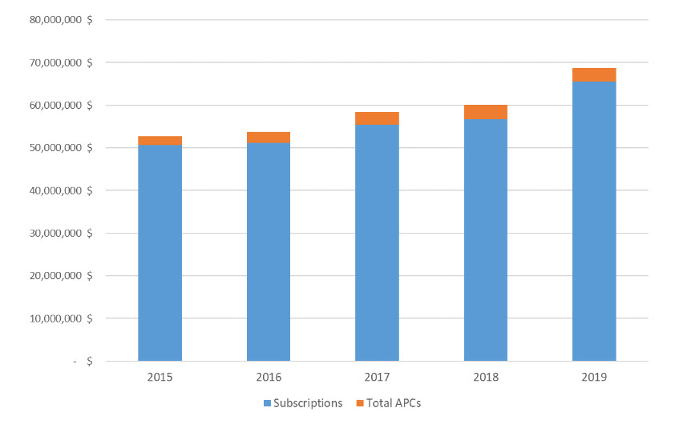
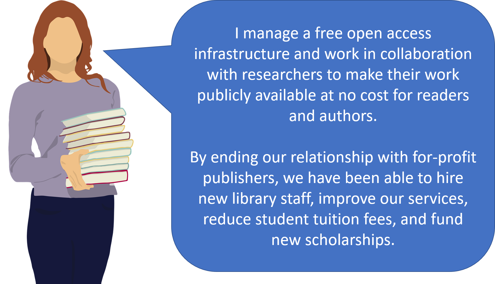
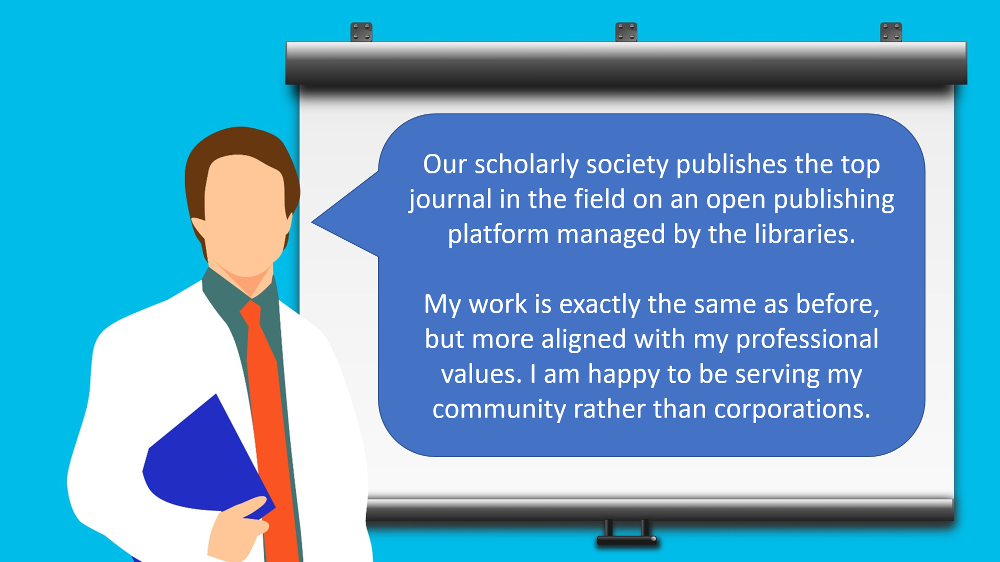
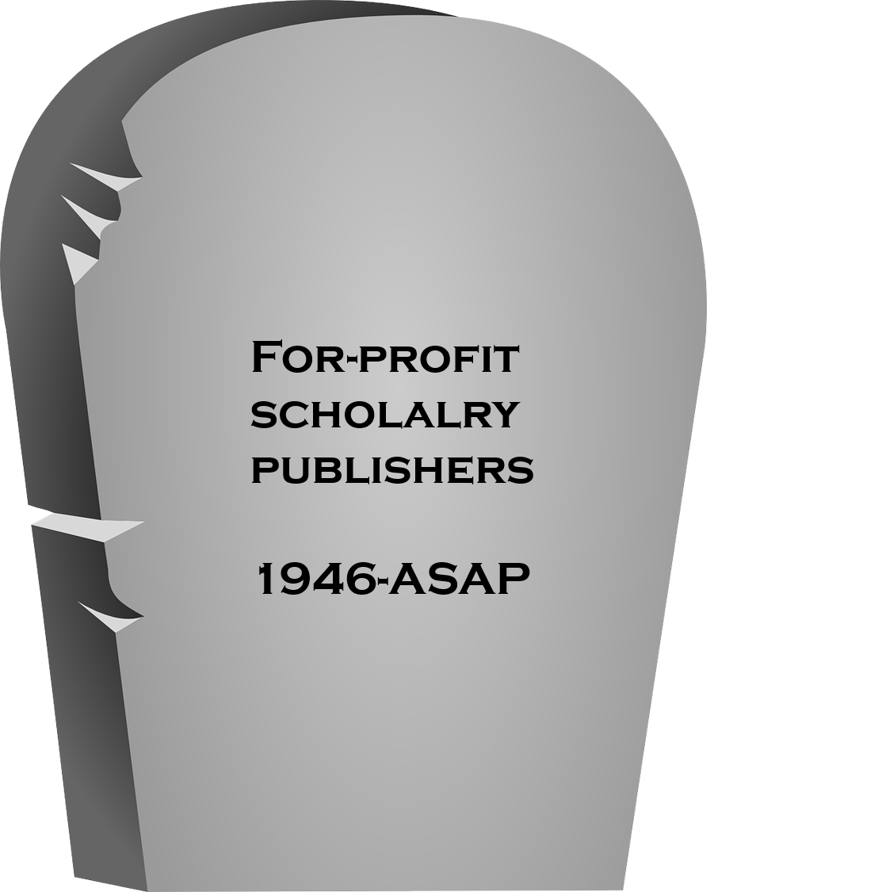
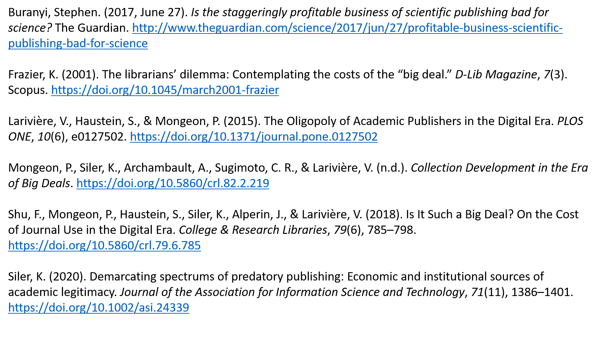

# Bibliometrics and scholarly communications

Chapter 10 - Open Access

```{=html}
<style>
    .reveal section img { 
        background:none; 
        border:none; 
        box-shadow:none; 
</style>
```
# **Scholarly publishing: a short story**

# **The actors**

## **The researcher**



## **The librarian**


## **The publisher**



# **Part 1 - Building one of the most profitable industry on the planet**

# **Genesis (1951-1991)**

{width="217"}

Robert Maxwell owned Pergamon Press (formerly Buttersworth) from 1951 to 1991.

## **A limitless market**

*"Scientific articles are about unique discoveries: one article cannot substitute for another. If a **serious** new journal appeared, scientists would simply request that their university library subscribe to that one as well. If Maxwell was creating three times as many journals as his competition, he would make three times more money."* (Buranyi, 2017).

## **Enrolling researchers**

"We would get dinner and fine wine, and at the end [Robert Maxwell] would present us a cheque -- a few thousand pounds for the society. It was more money than us poor scientists had ever seen." *Leslie Iversen, former editor at the Journal of Neurochemistry.*

## **Price inelasticity**

*"Between 1975 and 1985, the average price of a journal doubled. The New York Times reported that in 1984 it cost \$2,500 to subscribe to the journal Brain Research; in 1988, it cost more than \$5,000"* (Buranyi, 2017).

*"Scientists are not as price-conscious as other professionals, mainly because they are not spending their own money"* <br> - Robert Maxwell, 1988.

# **Consolidation: Elsevier buys Pergamon Press (1991)**

*"You have no idea how profitable these journals are once you stop doing anything...*" - Pierre Vinken, former Ceo of Elsevier (Buranyi, 2017)

## **Breaking point**

*"By 1994 [...] Elsevier had raised its prices by 50%. Universities complained that their budgets were stretched to breaking point"* (Buranyi, 2017)

## **The "big deals"**

With the move to digital publishing in the late 1990s, the publishers offered access to all their electronic journals in a single package with fixed annual price increase.

Libraries could save money by canceling the print subscriptions.

## **Entrapment**

*"Academic library directors should not sign on to the Big Deal or any comprehensive licensing agreements with commercial publishers." (Frazier, 2001)*

-   Forced acquisition of journals that we don't want or need.

-   Increased dependency on commercial publishers with monopolistic ambitions.

## **Increased control over scholarly publishing....**

Share of Web of Science publications published by the top 5 publishers



## Increased control of the libraries' budgets

Expanditures of the 34 university libraries consistently reported in the ARL statistics. 1986-2011 (Shu et al. 2017)

{width="619"}

# **Part 2 - The Open Access (OA) movement**

{width="499"}

## **What is OA?**

Open Access (OA) is a process that aims to make research output freely available on the public internet, allowing the users to read, download, copy, distribute, print, search or link to the full text without any financial, legal or technical barrier, in accordance with an open copyright license (usually [[CC-BY]{.underline}](https://creativecommons.org/licenses/by/2.0/)) (Budapest Open Access Initiative, 2002)

## **Green OA (self archiving)**

Journals often allow authors to make their work available online in places such as:

-   Institutional repositories (e.g., Atrium here at Guelph);

-   Disciplinary repositories (e.g., PubMed Central, ArXiv, SocArXiv, BioRxiv);

-   Their website.

Information on individual journal policies: [\<https://v2.sherpa.ac.uk/romeo/\>](https://v2.sherpa.ac.uk/romeo/){.uri}

## **Gold OA (OA journals)**

The journal does not sell subscription to libraries and all published articles are openly available directly on the publisher's website at the moment of publication.

This model typically (but not always) involves an article processing charge (APC) than can range from 0\$ to 9500 Euros per paper.

# **The open access** <strike>**movement**</strike> **gold mine**

{width="652"}

## **Multiple gold mines**

-   Library budgets (nearly depleted gold mine)

-   Authors research budgets and personal funds (unexploited gold mine)

-   Governments spending to support open access (unexploited gold mine).

*Once they had exhausted the libraries' capacity to pay they turned to the researchers' infinite need to publish papers, and universities ambition to climb in the rankings, and the global push for open access.*

## **Open access mega journals**

-   Charateristics

    -   High publication volume

    -   High acceptance rate

    -   No instistance on novelty

-   Examples

    -   Scientific Reports (Springer-Nature)

    -   SAGE open (Sage)

    -   SpringerPlus (Springer)

## **Hybrid OA**

**Subscription** journals that allow researchers to pay a fee for their article to be openly available on the publishers website at the moment of publication.

{width="651"}

## **Adding up APCs and the subscriptions**

Subscription prices + APCs paid to Elsevier, Sage, Taylor & Francis, and Wiley.



# **Transformative agreements:** <br> **"big deals" 2.0?**

Tranformative agreements seek to shift scholarly publishing away from subscription-based models and towards open access.

## **The SAGE deal with Canadian Universities**

-   Free hybrid OA for authors as part of the "big deal"

-   6% increase to the "big deal" price.

## **The Wiley deal with German universities**

-   Access to the "big deal" journals restored.

-   Universities to pay 2,750 euros per articles authored by their researchers.

## **The Elsevier deal with the University of California**

-   Access to the "big deal" journals restored.

-   Hybrid OA becomes the standard (authors need to opt-out)

-   First 1000\$ paid by the University

-   Rest paid by the author

-   If the author has no research funds, the library will pay

## **The Elsevier deal with CRKN**

-   A 12.5% reduction for 2021, followed by a 0% change for 2022, and a 2% increase for 2023.

-   Cost savings of US\$17.4 million over three years (when compared with a three-year contract with anticipated 2% annual increases).

-   A 20% discount on Article Processing Charges (APCs) for both hybrid and gold open access journals.

<font size="5">Source: <https://www.crkn-rcdr.ca/en/crkn-meets-bold-negotiation-objectives-elsevier-renewal></font>

# **Why transformative agreements could be good**

-   Reduced pressures on library budgets.

-   Reduced inequalities of access to open access publishing.

-   Increased access.

# **Why transformative agreements could be bad**

## **Status quo of financial and power dynamics?**

-   Maintained grasp of large publishers on scholarly publishing.

-   Maintained (most likely increased) profits.

## **Killing the competition?**

Will authors choose to pay APCs to a small publisher that does not have a transformative agreement with his institution?

## **Killing the will to change?**

*"Scientists are not as price-conscious as other professionals, mainly because they are not spending their own money"* <br> - Robert Maxwell, 1988.

# **Part 3 - Reclaiming scholarly publishing**

If we consider accessing and participating to research as a human right, we must:

-   Eliminate the corporate for-profit logic from the scholarly publishing ecosystem

-   Replace it with a focus on equality and the public good

## **Resume journal cancellations**

A large number of Libraries around the world are taking a hard line with their negotiations with the big publishers.

<https://bigdeal.sparcopen.org/cancellations>

## **We pay for journals we don't use anyways**

Share of journals considered core in the 28 universities that participated in the Journal Usage Project

{width="594"}

<font size = "5">Source : Mongeon et al. (2021)</font>

## **Developing infrastructures and services**

Continue to development of institutional repositories, dissemination platforms, and other tools that support open access and open research.

## **Institutional open research policies**

Develop policies with strong (but not oppressive) OA mandates.

## **Creating value-driven alternatives to for-profit journals**

*"I have no choice. I have to publish in those commercial journal if I want to get a job in academia, or tenure" -* Everyone

## **Your association's journal is published by a corporation?**

Demand change!

## **Editorial migration to new journals**

The entire board of the *Journal of Informetrics* resigned to launch a new open access journal, *Quantitative Science Studies*, on the basis that:

-   Scholarly journals should be owned by the scholarly community.

-   Journals should be open access under fair principles.

-   Citation data should be freely available.

## **Key success factor**

-   Collective initiative by the elite of the field.

-   Endorsement of the International Society for Scientometrics and Informetrics ([\<https://www.issi-society.org/\>](https://www.issi-society.org/){.uri})

## **Challenges**

-   The *Journal of Informetrics* still exists.

-   QSS doesn't have an impact factor yet.

-   Article Processing Charges.

## **The CJILS transition to OA**

In 2020, The Canadian Association for Information Science (CAIS) ended its contract with UTPress for the publication of its journal: *The Canadian Journal of Information and Library Science*.

## **Key success factors**

-   The support of the community

    -   A recognition that free Open Access is the only publishing model that aligns with our professional values

    -   A dedicated group of volunteers eager to contribute.

-   The Open Journal System (OJS) developed by the Public Knowledge Project ([\<https://pkp.sfu.ca/\>](https://pkp.sfu.ca/){.uri})

-   Non-profit publishing partners

    -   Érudit ([\<https://www.erudit.org/\>](https://www.erudit.org/){.uri})

    -   Coalition Publica ([\<https://www.coalition-publi.ca/\>](https://www.coalition-publi.ca/){.uri})

## **Negotiate** <strike>**harder**</strike> **no more**

It's our way, or no way.

# **What a brighter future would look like**

## **The librarian**



## **The researcher**



## **The public**


## 

{width="580"}

# **References**


